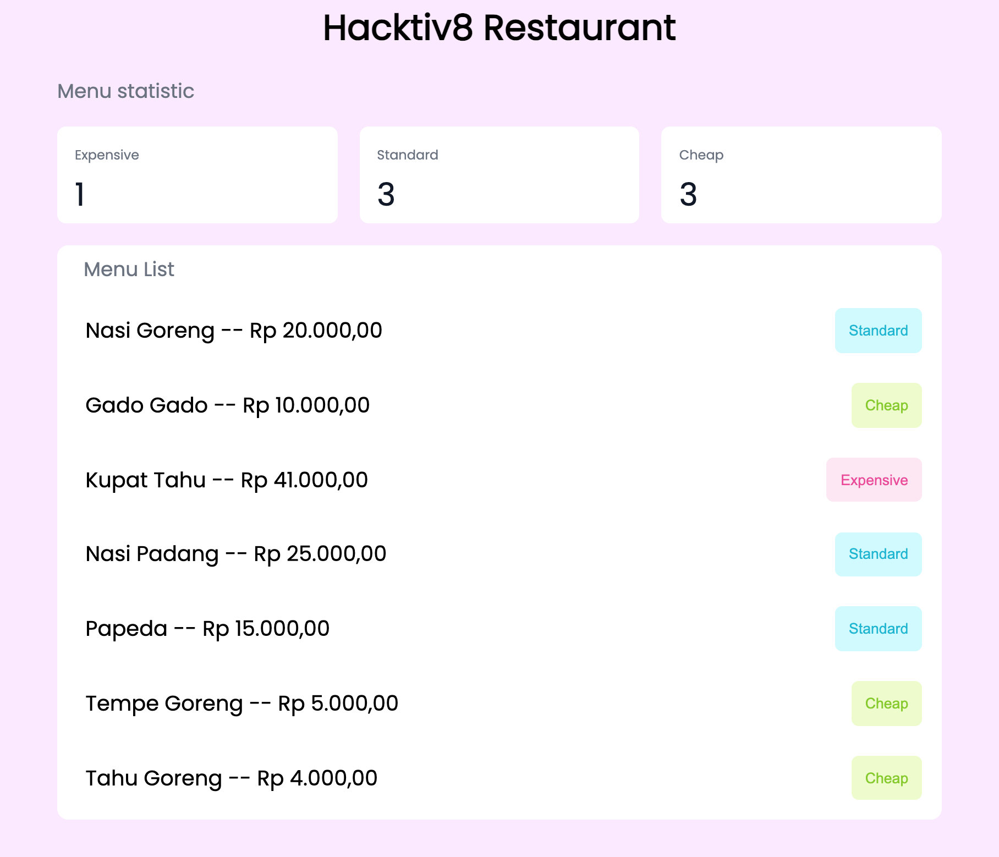

[](https://classroom.github.com/online_ide?assignment_repo_id=19439926&assignment_repo_type=AssignmentRepo)
# Restaurant

### NOTES

- Jalankan `npm install` terlebih dahulu
- Pada skeleton terdapat folder `__tests__`, folder ini beserta file-file di dalamnya tidak boleh diubah sama sekali.
- untuk menjalankan test untuk memastikan solusi kamu sudah benar, jalankan command `npm test`

### RESTRICTION

- Hanya boleh menggunakan built-in function untuk menambahkan atau mengurangi data dalam array, seperti .shift(), unShift(), push(), dan pop() dan built-in function untuk mengakses isi dalam object seperti for..in, for...of, Object.keys(), dll

### HINTS

- Nama function **tidak boleh diganti dengan nama function lainnya**. Untuk detail fungsi akan mengacu kepada [Directions](#directions) yang disebutkan di bawah

---

## Objectives

- Mampu mengakses array multidimensi atau array of objects
- Mampu membuat array of objects
- Mampu memberikan styling yang tepat untuk elemen html
- Mampu mengimplementasikan DOM
- Mampu Mengimplementasikan Modular Function

## Directions

Pada challenge kali ini, kalian diberikan sebuah file `index.html`, `index.js`, dan `style.css`, ketiga file ini bertujuan untuk menampilkan sebuah website sederhana, website ini menampilkan konten menu pada sebuah `Restaurant` yang ada pada file `index.js`, dan juga website ini menggunakan styling dari file `style.css` yang memiliki beberapa class yang dapat diterapkan pada element html.

### Release 1 - `convertMenu`

Function ini akan menerima satu buah parameter berupa `array of string` dan akan dirubah menjadi `array multi dimensi`. Sebuah string dengan format `Nasi Goreng#20000` akan dirubah menjadi sebuah array `['Nasi Goreng', '20000']`. Terdapat juga sebuah string dengan format `Salmon Mentai` yang akan dirubah menjadi sebuah array `['Salmon Mentai']`.

```js
const foods = [
  'Nasi Goreng#20000',
  'Salmon Mentai',
  'Gado Gado#10000',
  'Kupat Tahu#41000',
  'Wagyu Steak',
  'Nasi Padang#25000',
  'Papeda#15000',
  'Ayam Rebus',
  'Tempe Goreng#5000',
  'Tahu Goreng#4000'
]

function convertMenu(foods) {
  // code here
}

console.log(convertMenu(foods))
/**
 * [
 *  ['Nasi Goreng', '20000'],
 *  ['Salmon Mentai'],
 *  ['Gado gado', '10000'],
 *  ['Kupat tahu', '41000'],
 *  ['Wagyu Steak'],
 *  ['Nasi padang', '25000'],
 *  ['Papeda', '15000'],
 *  ['Ayam rebus'],
 *  ['Tempe goreng', '5000'],
 *  ['Tahu goreng', '4000']
 * ]
 * /
```

### Release 2 - `filterMenu`

Function ini akan menerima sebuah `array 2 dimensi` dan akan melakukan penyaringan terhadap menu yang tidak memiliki `harga`. `harga` pada sebuah array `makanan` diwakilkan pada index pertama data tersebut.

**notes**

- Pada fungsi ini silahkan convert harga yang masih berupa `string` `'20000'` menjadi sebuah `number` `20000`

**Contoh**

```
['Nasi Goreng', '20000'] => menu ini memiliki harga '20000'.

['Salmon Mentai'], => menu ini tidak memiliki harga dikarenakan hanya memiliki satu data didalamnya.
```

```js
const foods =  [
   ['Nasi Goreng', '20000'],
   ['Salmon Mentai'],
   ['Gado gado', '10000'],
   ['Kupat tahu', '41000'],
   ['Wagyu Steak'],
   ['Nasi Padang', '25000'],
   ['Papeda', '15000'],
   ['Ayam rebus'],
   ['Tempe Goreng', '5000'],
   ['Tahu Goreng', '4000']
]
function filterMenu(foods) {
  // your code here
}

console.log(filterMenu(foods))
/**
 * [
 *  ['Nasi Goreng', 20000],
 *  ['Gado gado', 10000],
 *  ['Kupat tahu', 41000],
 *  ['Nasi Padang', 25000],
 *  ['Papeda', 15000],
 *  ['Tempe Goreng', 5000],
 *  ['Tahu Goreng', 4000]
 * ]
 * /

```

### Release 3 - `statusMenu`

Function ini akan menerima satu buah parameter, parameter pertama `foods` merupakan `array multi dimensi` berisi kumpulan `menu` yang dimiliki,

Function ini akan memberikan kategori untuk setiap `foods` dengan aturan:

- Jika harga makanan melebihi `30000` maka `food` tersebut memiliki status `expensive`.
- Jika harga makanan diantara `15000` hingga `30000` maka `food` tersebut memiliki status `standard`.
- Jika harga makanan dibawah `15000` maka `food` tersebut memiliki status `cheap`.

```js
const foods = [
  ['Nasi Goreng', 20000],
  ['Gado gado', 10000],
  ['Kupat tahu', 41000],
  ['Nasi Padang', 25000],
  ['Papeda', 15000],
  ['Tempe Goreng', 5000],
  ['Tahu Goreng', 4000]
]

function statusMenu(foods) {
  // your code here
}

console.log(statusMenu(foods))
/**
 * [
    ['Nasi Goreng', 20000, 'standard'],
    ['Gado gado', 10000, 'cheap'],
    ['Kupat tahu', 41000, 'expensive'],
    ['Nasi Padang', 25000, 'standard'],
    ['Papeda', 15000, 'standard'],
    ['Tempe Goreng', 5000, 'cheap'],
    ['Tahu Goreng', 4000, 'cheap']
  ]
 */
```

### Release 4 - `statisticMenu`

Function ini akan menerima satu parameter berupa `array 2 dimensi` kumpulan `foods`. Function ini akan mengembalikan sebuah `object` menandakan jumlah `food` yang memiliki status `cheap`, `standard` dan juga `expensive`.

```js
const foods = [
    ['Nasi Goreng', 20000, 'standard'],
    ['Gado gado', 10000, 'cheap'],
    ['Kupat tahu', 41000, 'expensive'],
    ['Nasi Padang', 25000, 'standard'],
    ['Papeda', 15000, 'standard'],
    ['Tempe Goreng', 5000, 'cheap'],
    ['Tahu Goreng', 4000, 'cheap']
  ]

function statisticMenu(foods) {
  // your code here
}

console.log(statisticMenu(foods))
/**
 * {
 *   standard: 3,
 *   cheap: 3,
 *   expensive: 1
 * }
 *
```

### Release 5 - `generateMenu`

Function ini merupakan **main** function yang akan memanggil fungsi yang sudah dibuat sebelumnya. function ini akan menerima satu parameter berupa `array of string` yang akan mengembalikan sebuah `object` dengan dua `key`:

- `statistic` `key` ini akan berisi object jumlah `food` dengan status `cheap`, `standard` dan juga `expensive`.
- `foods` `key` ini akan berisi sebuah `array of object` kumpulan `food` yang ada. Format `object` pada `key` ini adalah:
  - `name` berisi nama dari `food`.
  - `price` berisi harga dari `food`.
  - `status` berisi status dari `food`.

```js
const foods = [
  'Nasi Goreng#20000',
  'Salmon Mentai',
  'Gado Gado#10000',
  'Kupat Tahu#41000',
  'Wagyu Steak',
  'Nasi Padang#25000',
  'Papeda#15000',
  'Ayam Rebus',
  'Tempe Goreng#5000',
  'Tahu Goreng#4000'
]


function generateMenu(foods) {}

console.log(generateMenu(foods))
/**
 * {
      statistic: { standard: 3, cheap: 3, expensive: 1 },
      menu: [
        { name: 'Nasi Goreng', price: 20000, status: 'standard' },
        { name: 'Gado Gado', price: 10000, status: 'cheap' },
        { name: 'Kupat Tahu', price: 41000, status: 'expensive' },
        { name: 'Nasi Padang', price: 25000, status: 'standard' },
        { name: 'Papeda', price: 15000, status: 'standard' },
        { name: 'Tempe Goreng', price: 5000, status: 'cheap' },
        { name: 'Tahu Goreng', price: 4000, status: 'cheap' }
      ]
   }
 * /
```

### Release 6 - `DOM`

Setelah kamu berhasil menyelesaikan semua fungsi diatas, maka step selanjutnya adalah menampilkan data `statistic` dari `menu` yang kamu punya. Silahkan gunakan `DOM` pada file `index.js` untuk memasukkan data `statistic` dari javascript menuju `HTML`.

### Release 7 - `CSS`

Tambahkan juga sebuah style CSS pada file `style.css` untuk memberikan warna background dan tulisan untuk ketiga button yang kita miliki. Warna yang digunakan bisa mengikuti table berikut ini:

| class              | Warna Background | Warna Text |
| ------------------ | ---------------- | ---------- |
| `standard-button`  | #cffafe          | #06b6d4    |
| `expensive-button` | #fce7f3          | #ec4899    |
| `cheap-button`     | #ecfccb          | #84cc16    |

Berikut adalah tampilan yang diharapkan untuk menyelesaikan release ini.


