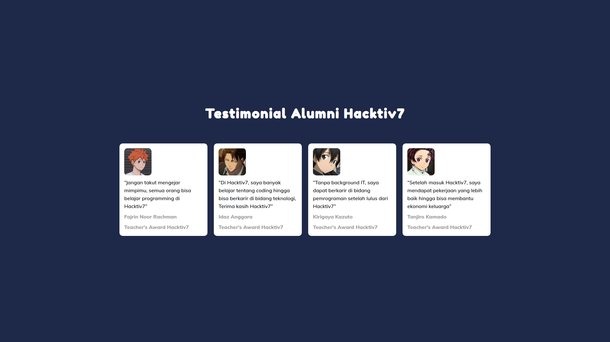

# Number 1 - Livecode Simulation 3

## **TESTIMONIAL ALUMNI HACKTIV7**

 

## Restriction
- Kalian hanya diperbolehkan melakukan perubahan di file **`1.html`**

 

## Objectives
- Mampu menyelesaikan masalah yang diberikan.
- Mengerti konsep dan cara penggunaan `html` dan `css`.

 

## Directions

Hacktiv7 ingin membuat web yang menampilkan list testimonial beberapa alumni nya, namun developer hacktiv7 yang ditugaskan untuk membuat web ini tidak dapat melanjutkan web nya dikarenakan sakit. 

Bantulah Hacktiv7 untuk menyempurnakan tampilan web yang sudah dibuat oleh developer sebelumnya!

Kalian akan diberikan dua file yaitu:
- `1.html`
- `1.css`

File diatas sudah berisikan kode-kode yang sudah dikerjakan oleh developer Hacktiv7 sebelumnya, namun masih belum sempurna.

Tugas kalian adalah menyelesaikan kode di dalam file **`1.html`** agar tampilan web nya sesuai dengan yang diharapkan.

 

## Notes

- Contoh tampilan website yang diharapkan bisa dilihat di file **`1reference.png`**

 

